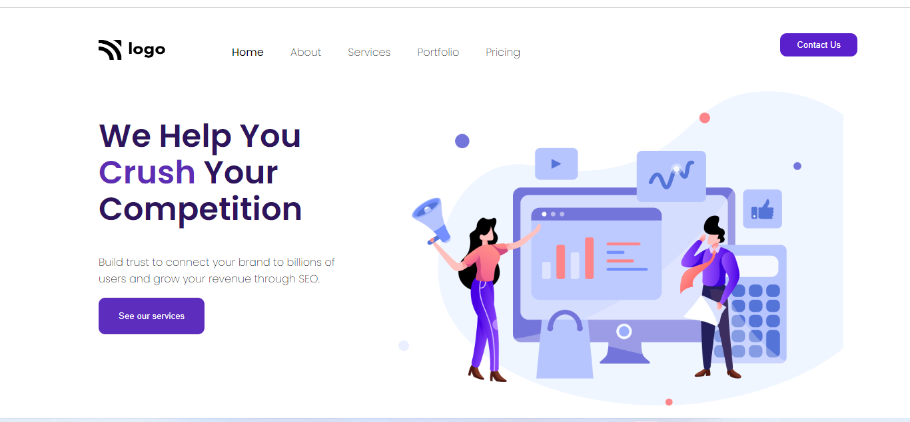

## My Name is Ajay.
## Project 4 from web dev bootcamp - Ineuron
# [Live website Link](https://service-webpage.netlify.app/)
### In this project, I learnt how to make a website look attractive, by playing with the colors. The website as you see is quite minimalistic and yet super attractive. The intension of the website is clear and there's no clutter. It was quite satisfying to complete.

### Time Taken to complete the prject: 2 hours.

### Website Preview:-

